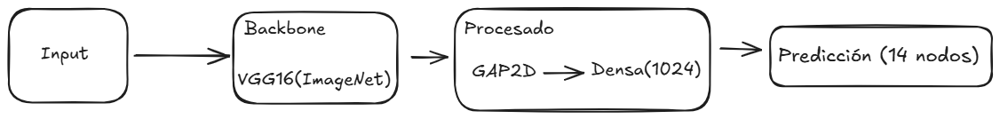
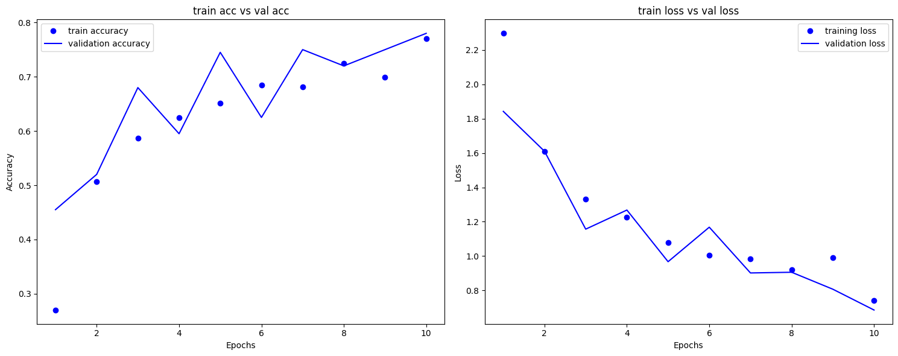
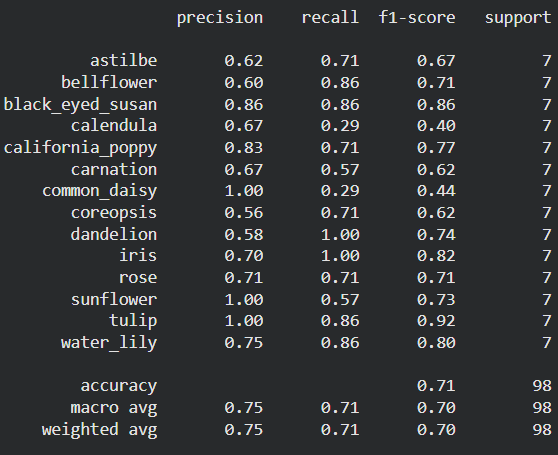
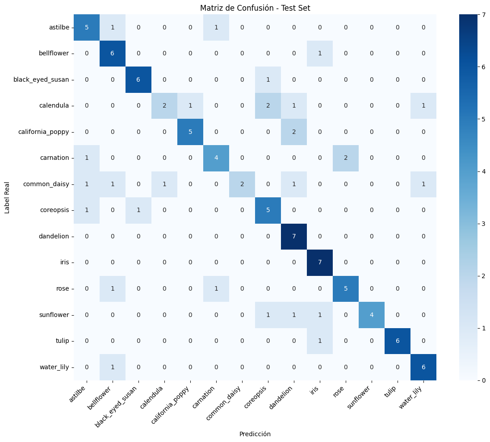
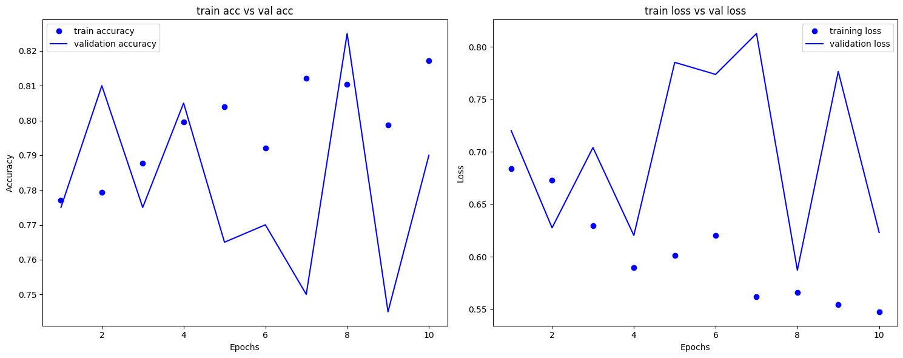
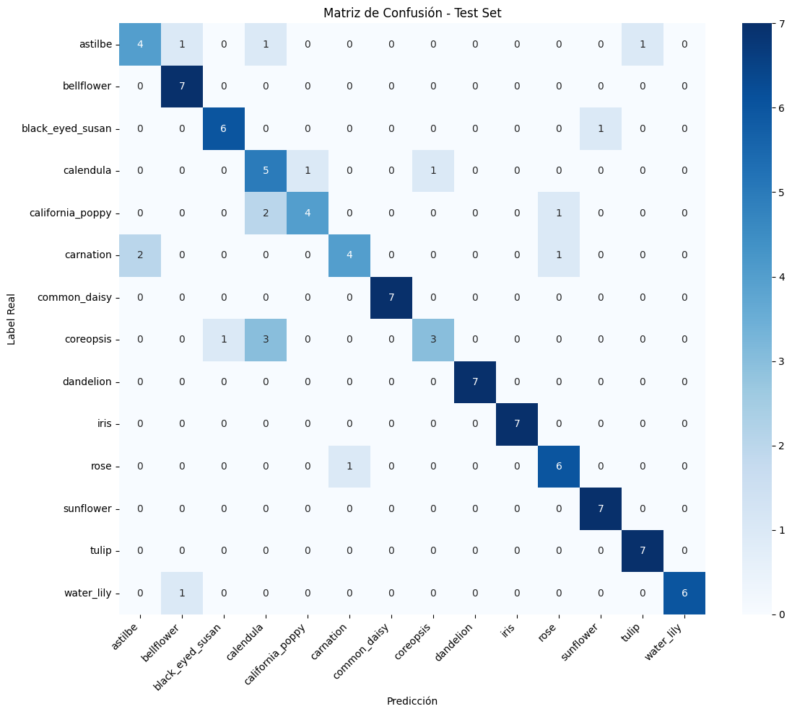

# FlorANK
Mi proyecto de Inteligencia artificial que busca solucionar un problema de mi novia. Ella no sabe mucho de flores y siempre que ve una se pregunta que flor es, este modelo busca satisfacer su curiosidad y aunque es complicado contemplar todas las flores que existen, con unas cuantas se puede empezar.

#### Disclaimer
Por motivos de peso, los archivos [FlorAnk.keras](https://drive.google.com/file/d/19cGIrZy5z4RPCpjZOyndbgOaoGddOTjR/view?usp=drive_link) (modelo final) y [FlorAnkInicial](https://drive.google.com/file/d/1xIS1WcRm5OpAUjBmwdhVP5nsiYry9UxW/view?usp=drive_link) (modelo inicial) están disponibles haciendo clic en estos enlaces. 

## Uso
Para usar el modelo, debimos haber descargado dos archivos, el modelo que se encuentra en los enlaces de arriba y descargar el archivo: "ambiente_de_prueba", deberemos ubicar en la misma carpeta ambos archivos y dentro de Google Drive deberemos tener esta estructura de carpetas: "/content/drive/MyDrive/8vo/data/Flowers/usage", en esta última carpeta "usage", deberemos insertar imágenes que queramos clasificar, ya sean plantas, personas, flores, etcétera. Y aunque este modelo está orientado en su totalidad a la clasificación de plantas, es muy entretenido ver que flor eres segun el modelo.
Con fotos dentro de la carpeta de usage, es que podemos empezar a ejecutar el proyecto (ambiente_de_prueba), se deben ejecutar todas las celdas en un orden descendente, esto permitirá que el programa aplique los filtros necesarios a las imágenes que carguemos, además de asegurar un buen funcionamiento.

----

# Primera entrega
Para esta etapa del proyecto he de obtener un set de datos, haber separado los datos en prueba y en entrenamiento, debí haber aplicado las técnicas de escalamiento y hacer el preprocesado pertinente.

## Obtención del set de datos
Acudí a la página de kaggle.com e hice una búsqueda por datasets de clasificación de flores, en mi búsqueda encontré el dataset de [Marquis03](https://www.kaggle.com/datasets/marquis03/flower-classification). Este set ofrece 13 mil registros de imágenes de tamaño 256x256 en RGB, además de estar etiquetados.

## Separación de datos de prueba y de entrenamiento
Marquis03 ya había separado las imagenes en train y val. Lo que hice yo fue utilizar val como mis datos de prueba ya que se encuentran aisladas en carpetas y subcarpetas distintas, aún así creé una subdivisión para la etapa de validación real en los datos de train, esto me permitirá verificar que el modelo no aprenda del ruido, sino de las características de cada flor.
Las carpetas se encuentran en mi [Drive](https://drive.google.com/drive/folders/14JBFmcF31-db9eyofANAiShgmEpXoXDn?usp=drive_link).

## Técnicas de escalamiento
La técnica de escalamiento que se utilizó fue transformar las dimensiones de los colores de RGB que son intervalos de 0 a 255, a intervalos que son de 0 a 1.

## Preprocesamiento de datos
El preprocesado que se le dio a los datos fue uno muy estándar, puesto que el propio dataset está un poco balanceado, sí existen desbalances, pero esto se puede arreglar posteriormente, pero sí existe cierto desbalance hacia los tulipanes, esto hizo que el preprocesado de datos fuera necesario, especialmente al hacerle data augmentation y considerar otras estrategias.
Esta mejora en los datos se refiere a la alteración del brillo, contraste y voltear en el eje x las imagenes, este augmentation sí proporcionó una diferencia notable en el rendimiento del modelo.

# Segunda entrega
Para la segunda entrega Seleccionar un modelo respaldado por un artículo del estado del arte, Implementar el modelo usando un framework seleccionado, Seleccionar métricas adecuadas respaldadas por un artículo del estado del arte, Reportar resultados obtenidos e interpretarlos. 

## Seleccionar un modelo
Inicié con la búsqueda de un artículo en Scopus, utilicé las palabras clave: "Flower", "Classification" y "CNN" para agilizar la búsqueda, y tras unos minutos de búsqueda me encontre el paper: [Comparative analysis of CNN-based approaches for flower classification](https://www.sciencedirect.com/science/article/pii/S2772375526004338?fr=RR-2&rr=a04786110b9e219c), este paper me pareció muy interesante puesto que se implementaron y compararon 5 modelos distintos para así determinar cual es el mejor modelo para determinar la etapa de floración y la especie de una flor, el paper solo utiliza dos especies, rosas y girasoles, pero identifica 4 etapas de floración. Este paper concluye que un VGG16 es el modelo adecuado para la problemática y propone algunas capas y parámetros.

## Implementación del modelo
Para la implementación del modelo me apoyé mucho en el paper antes mencionado, en este se propone un modelo de transfer learning con un backbone de VGG16 no entrenable sin el top, este backbone estaría entrenado con ImageNet, que es un dataset que sirve para la identificación visual de objetos, y después de eso se procesará por dos capas, una de pooling y otra densa de 1024 neuronas para que hagan el procesado y finalmente una última capa con softmax para clasificar entre las 14 clases presentes en el dataset.

### Funciones de pérdida e hiperparámetros
Su función de pérdida es sparse categorical cross entropy, esto porque mis etiquetas son números enteros y no un vector como se utiliza en categorical cross entropy, mejorando el rendimiento al calcular un número en lugar de un vector. 

| Hiperparámetro                   | Valor |
| -------------------------------- | ----- |
| Épocas                           | 10    |
| Optimizador                      | Adam  |
| Steps de entrenamiento por época | 80    |
| Steps de validación              | 20    |

Está primera iteración de los hiperparámetros fue mediante un cálculo para asegurar que en cada época hubiera imágenes nuevas, porque en su momento pensé que sería una buena idea, pero después de ver la matriz de confusión determiné que para la mejora, uno de los puntos más importantes sería aumentar estos steps.

## Seleccionar métricas adecuadas
El mismo artículo utilizó cuatro métricas, Accuracy, Precision, Recall y F1 Score, esto para evaluar cada uno de sus modelos y así determinar cual satisfacia la necesidad de una manera más integra. El estudio utilizó la misma metodología de validación y test para identificar la posibilidad de overfit dentro de los modelos.
### Evaluación inicial
Al graficar el accuracy de training y validation podemos determinar si un modelo está overfiteado, a continuación se encuentran las gráficas de accuracy y de pérdida.

En la gráfica de accuracy debemos ver un incremento gradual hacia el número 1, mientras que en la de pérdida se debe acercar al número 0.
En este caso podemos ver que el accuracy del entrenamiento se posiciona en 0.76, es decir, el 76% de las veces que una flor sea presentada ante el modelo va a ser determinado correctamente. En cuanto al accuracy en validación, podemos ver que se mantiene en el mismo valor (0.77), esto implica que el modelo es tan bueno al entrenar como al examinarse internamente. Al probarlo con test, el resultado final es de 0.71, esta varianza se debe a la cantidad de elementos que existen, puesto que solo hay 7 elementos por clase. Además de que podemos utilizar el F1 para determinar casos especiales en los que no le atina ni individualmente ni en conjunto con las demás clases. Para nuestro caso, las clases con mayor rendimiento fueron: el tulipan, el iris, y la margarita amarilla, estos tienen el valor de F1 más alto, que a su vez podemos determinar que tienen características suficientemente diferentes como para que el modelo las identifique. Por el contrario, la calendula, margarita y el clavel.

Eso sí al observar la matriz de confusión y las métricas noté un poco de desbalance en cuanto a las clases, hay algunas clases super puestas ante otras, y esto confirma la teoría de que debemos centrarnos en el clavel, margarita y calendula. 

## Refinamiento
Para el refinamiento del modelo, antes que nada anoté las clases subrepresentadas, puesto que esto significa que hay un desbalance en los datos para la clasificación, para mitigar esta parte implemente class weights. Las class weights "castigan" al modelo con mayor severidad si es que este cataloga incorrectamente una clase subrepresentada, pero para que se haga correctamente, debemos contar el número de imágenes por clase y  calcular la proporción, aunque eso se lo dejo a sklearn con: `compute_class_weight()`, que me facilita todo el trabajo del cálculo y solo debo incluir este diccionario al entrenarlo para que se apliquen las class weights.

También agregué una capa intermedia antes de la capa de clasificación, una densa de 512 neuronas, que después de agregarla el modelo sí mejoró el rendimiento del mismo. Este cambio lo había implementado para reducir el cuello de botella que tendría la red, aunque sí había leído que al mantener en pocas capas el modelo, este aprendería lo necesario y no tendría redundancia en cuanto a las características de las flores.
La arquitectura queda así:

Asimismo, aumenté el número de pasos de la etapa de entrenamiento, pero solo después de haber agregado la capa densa de 512, porque al aumentar el número de steps el modelo anterior overfiteaba y dejaba de ser útil. Estos steps fueron aumentados de 80 a 500, pensé en un número más alto para que recorriera una gran cantidad de imágenes de entrenamiento, pero pensé en el overfit que generaría.
En cuanto a hiperparámetros no cambió mucho, solo los steps, lo que más cambió fue la arquitectura y la adición de los pesos para las clases 

| **Hiperparámetro**               | **Valor** |
| -------------------------------- | --------- |
| Épocas                           | 10        |
| Optimizador                      | Adam      |
| Steps de entrenamiento por época | 500       |
| Steps de validación              | 20        |

Estos cambios hicieron que el modelo pasara de un accuracy de 0.71 a uno de 0.82 en test, un incremento de 11 puntos, y en train y val pasó de 0.76 a 0.81, un incremento de 5 puntos, pero es dependiente del volumen de la prueba a la que se sometió, que en test fueron 7 imágenes por clase.
El accuracy y loss del modelo refinado se ve de esta manera:

Validación cuenta con 200 imágenes del propio dataset para examinar el modelo, el último valor de accuracy del modelo fue 0.81, y para la función de pérdida fue de 0.54 (training ambos).

En cuanto a la matriz de confusión, sí mejoró el balance entre las clases, esto significa que los class weights sí funcionaron para corregir la subrepresentación de las clases, aunque todavía existen clases subrepresentadas, como el coreopsis, la amapola de california, los claveles, entre otras clases. Pero sí es una diferencia considerable con la anterior.

En cuanto a métricas, a continuación se desglosa en una tabla las métricas que se utilizaron y la mejora que obtuvieron después de la tercera entrega:

| **Métrica**     | **Modelo Inicial** | **Modelo refinado** | **Mejora** |
| --------------- | ------------------ | ------------------- | ---------- |
| Macro Precision | 0.75               | 0.83                | 8 puntos   |
| Macro recall    | 0.71               | 0.82                | 11 puntos  |
| Macro F1        | 0.70               | 0.81                | 11 puntos  |

## Resultados
La versión mejorada del modelo sí es superior a la versión anterior, por un margen razonable. Mi modelo que estoy utilizando como inicial es vastamente superior al primer modelo que implementé, pero estaba creado a partir de decisiones arbitrarias y sin fundamento en documentos relevantes. Asimismo se aumentaron los datos de ambos modelos en un inició, y por lo mismo no se consideró el aumento como una mejora. 

## Referencias
Agrawal, S., Datta, R., Pal, A. R., Angione, C., & Krishnasamy, K. (2026). Comparative analysis of CNN-based approaches for flower classification. Smart Agricultural Technology, 14, 102213. [https://doi.org/10.1016/j.atech.2026.102213](https://doi.org/10.1016/j.atech.2026.102213)

